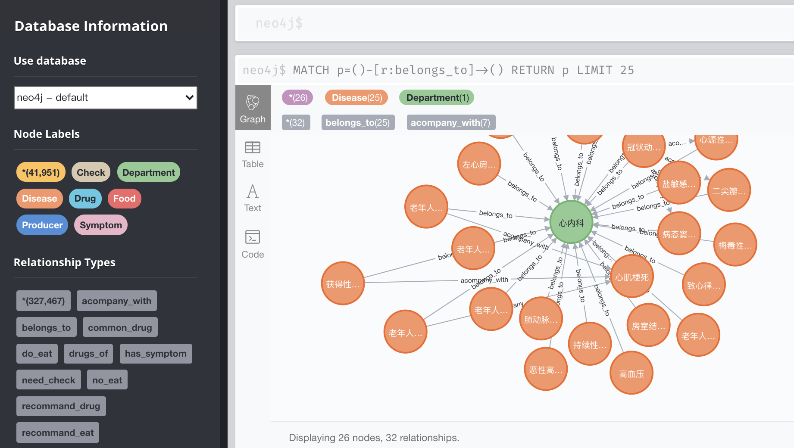
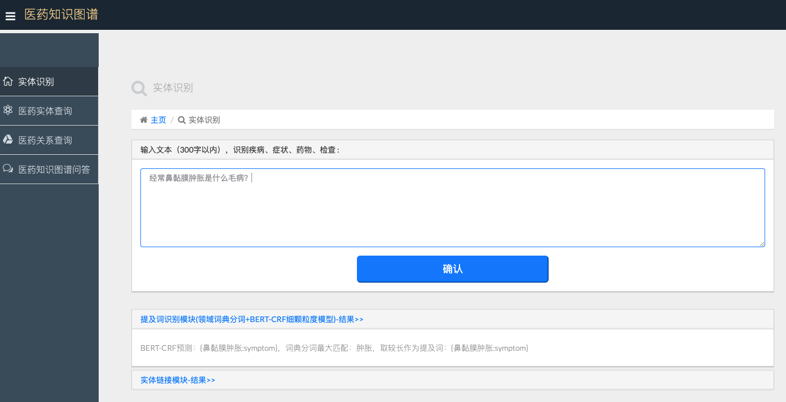
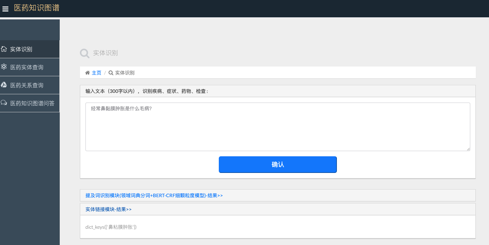
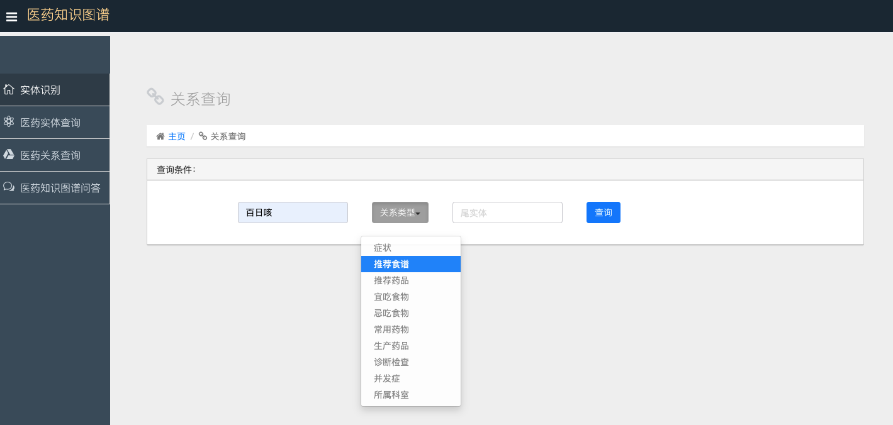
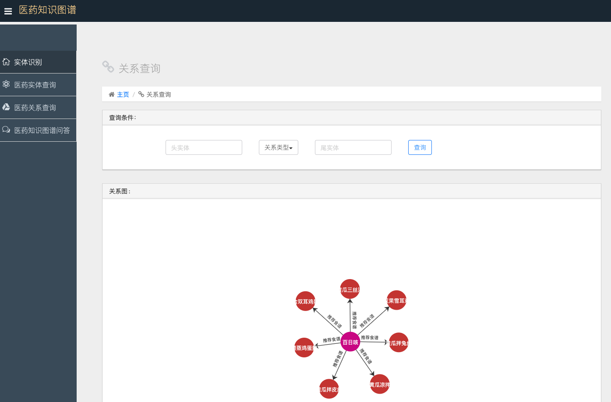
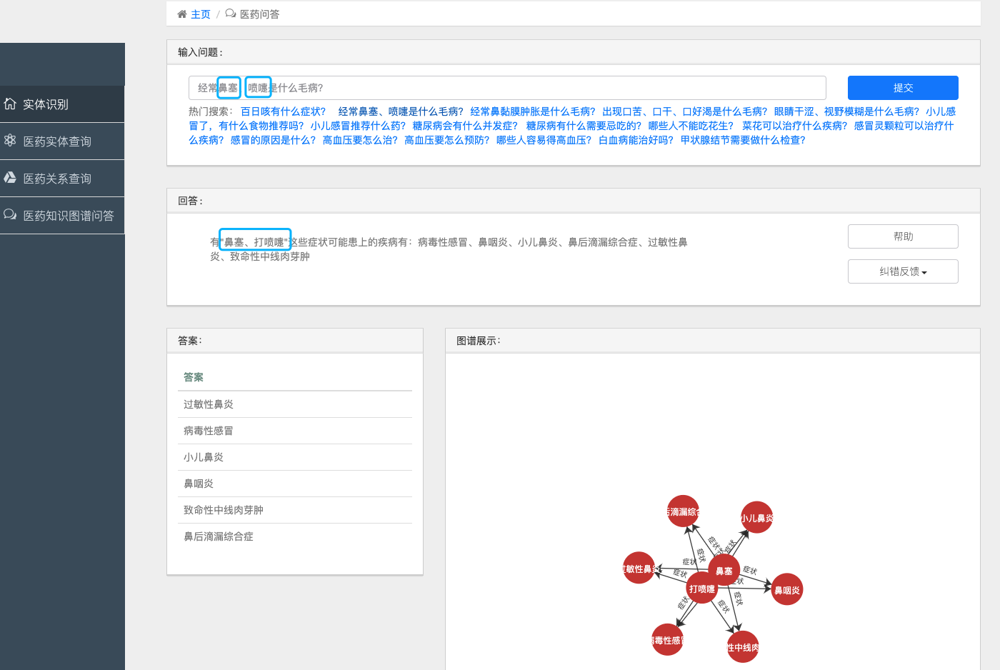

# medical_knowledge_graph_app

## 项目说明

* 一、构建医药知识图谱
* 二、搭建自动问答后端
* 三、增加前端交互

在构建医药知识图谱和自动问答时，参考了项目[^1]。在构建医药知识图谱和问答系统上做了如下优化：

1. 原项目存在无法回复症状到疾病的问题。因此通过爬虫直接把重新爬了每个疾病的症状描述文本。同时把原来网站的症状库所有症状名爬取得到症状名字典。
2. 用ac算法取出症状描述文本中与症状库名对齐的所有症状 4377 个（symptom.txt）。重构疾病名-症状-症状名三元组 99492 个。
3. 关于提及symtom推理disease的提问，由原来的单独找每个症状后合并结果改成支持多个症状的疾病交集。
4. 当描述的症状口语化，与症状库名字无法精确匹配时，先用BERT+CRF模型[^2]做命名实体识别。标注方法用的是BIO+C（C表示实体类型，drug/symptom/disease等），构建数据集是基于问题模板随机从领域词典中抽取领域词更替问句中的提及词槽位，每个词只出现一次。训练好的模型参数下载地址（ 链接: https://pan.baidu.com/s/1ZGCzYIs-Vo1bsL40XRPtfw 密码: 96ln ），解压放到目录med_kg/ner_model/outputs下。
5. 用模型SBERT[^3]把识别出来的提及词和对应类型的词典（存起来的embedding）做相似度计算，得到top20后，结合重叠字的长度，把重叠字最长的作为实体链接的结果。
6. 本项目的意图识别依然沿用原项目基于规则的提问词+提及词类型的模板方法实现。
7. todo:重新构建疾病的患病率属性，目前没有构建。进而通过描述症状得到多个候选疾病时，按患病概率从高到低演示。
8. todo:目前没有用到深度学习的意图识别模型，是通过提问词匹配到问题意图的，可以考虑用一些医药领域问题复述相似度的数据集，去实现泛化能力强的意图识别模块。

在建好知识图谱和问答系统后，增加前端交互和KG展示，用的是echarts的力引导图。实现参考项目[^4]。

## 启动项目
* 启动neo4j数据库
```
neo4j-community-4.1.4 % bin/neo4j start
```
* 执行主程序
```
medical_knowledge_graph_app-master % python med_kg/manage.py runserver 
```
## 项目目录

* img 功能界面图

* kg/prepare_data 爬虫文件
* kg/data/medical_rebuild.json 最终处理好的数据
* kg/build_medicalgraph.py 创建neo4j图数据库

* med_kg/el_model 实体链接模型

  * med_kg/el_model/embedding 疾病/药物/症状词典的词嵌入表示

  * med_kg/el_model/entity_linking.py 实体链接脚本

* med_kg/med_kg django框架的视图和配置文件

* med_kg/templates django框架的模版

* med_kg/static 前端bootstrap文件

* med_kg/ner_model 命名实体识别模型

  * med_kg/ner_model/models 命名实体识别模型模型代码

  * med_kg/ner_model/data 训练模型的数据

  * med_kg/ner_model/losses 训练模型的损失函数

  * med_kg/ner_model/outpus/1101medselfner-finetune 精调（训练好）的模型

  * med_kg/ner_model/prev_trained_model 放pytorch的预训练模型

* med_kg/util 工具，冷启动

* med_kg/Model 与neo4j图数据库交互的脚本

* med_kg/MedModel 自动问答
  
  * med_kg/MedModel/question_classifier.py 意图识别脚本

  * med_kg/MedModel/question_parser.py 把识别出的提及词和意图转为查询语句的脚本

  * med_kg/MedModel/answer_search.py 查询图数据库返回答案
  
  * med_kg/MedModel/dict 领域词典

## 一、知识医药图谱构建

### 1.知识图谱实体类型

‘*’ 号表示原项目基础上变化的项

| 实体类型   |   中文含义   | 实体数量 | 举例                                   |
| :--------- | :----------: | :------: | :------------------------------------- |
| Check      | 诊断检查项目 |  3,353   | 支气管造影;关节镜检查                  |
| Department |   医疗科目   |    54    | 整形美容科;烧伤科                      |
| Disease    |     疾病     |  8,807   | 血栓闭塞性脉管炎;胸降主动脉动脉瘤      |
| Drug       |     药品     |  3,828   | 京万红痔疮膏;布林佐胺滴眼液            |
| Food       |     食物     |  4,870   | 番茄冲菜牛肉丸汤;竹笋炖羊肉            |
| Producer   |   药品大类   |  17,201  | 通药制药青霉素V钾片;青阳醋酸地塞米松片 |
| Symptom*   |   疾病症状   |  4,377   | 乳腺组织肥厚;脑实质深部出血            |
| Total      |     总计     |  44,111  | 约4.4万实体量级                        |

### 2.知识图谱实体关系类型

‘*’ 号表示原项目基础上变化的项

| 实体关系类型   |   中文含义   | 关系数量 | 举例                                                 |
| :------------- | :----------: | :------: | :--------------------------------------------------- |
| belongs_to     |     属于     |  8,844   | <妇科,属于,妇产科>                                   |
| common_drug    | 疾病常用药品 |  14,649  | <阳强,常用,甲磺酸酚妥拉明分散片>                     |
| do_eat         | 疾病宜吃食物 |  22,238  | <胸椎骨折,宜吃,黑鱼>                                 |
| drugs_of       | 药品在售药品 |  17,315  | <青霉素V钾片,在售,通药制药青霉素V钾片>               |
| need_check     | 疾病所需检查 |  39,422  | <单侧肺气肿,所需检查,支气管造影>                     |
| no_eat         | 疾病忌吃食物 |  22,247  | <唇病,忌吃,杏仁>                                     |
| recommand_drug | 疾病推荐药品 |  59,467  | <混合痔,推荐用药,京万红痔疮膏>                       |
| recommand_eat  | 疾病推荐食谱 |  40,221  | <鞘膜积液,推荐食谱,番茄冲菜牛肉丸汤>                 |
| has_symptom*   |   疾病症状   |  99,492  | <早期乳腺癌,疾病症状,乳腺组织肥厚>                   |
| acompany_with  | 疾病并发疾病 |  12,029  | <下肢交通静脉瓣膜关闭不全,并发疾病,血栓闭塞性脉管炎> |
| Total          |     总计     | 294,149  | 约30万关系量级                                       |

### 3.知识图谱属性类型

| 属性类型      |   中文含义   |            举例             |
| :------------ | :----------: | :-------------------------: |
| name          |   疾病名称   |       喘息样支气管炎        |
| desc          |   疾病简介   |    又称哮喘性支气管炎...    |
| cause         |   疾病病因   |    常见的有合胞病毒等...    |
| prevent       |   预防措施   | 注意家族与患儿自身过敏史... |
| cure_lasttime |   治疗周期   |          6-12个月           |
| cure_way      |   治疗方式   |   "药物治疗","支持性治疗"   |
| cured_prob    |   治愈概率   |             95%             |
| easy_get      | 疾病易感人群 |        无特定的人群         |

## 二、搭建自动问答系统

### 1.支持问答类型

| 问句类型                |        中文含义        |         问句举例         | 说明             |
| :---------------------- | :--------------------: | :----------------------: | :--------------- |
| disease_symptom         |        疾病症状        |   乳腺癌的症状有哪些？   | 不同类实体间关系 |
| symptom_disease         |   已知症状找可能疾病   |   老流鼻涕是什么毛病？   | 不同类实体间关系 |
| disease_cause           |        疾病病因        |   为什么有的人会失眠？   | 实体属性         |
| disease_acompany        |      疾病的并发症      |    失眠有哪些并发症？    | 同类实体间关系   |
| disease_not_food        |   疾病需要忌口的食物   |    失眠的人不要吃啥？    | 不同类实体间关系 |
| disease_do_food         |   疾病建议吃什么食物   |      耳鸣了吃点啥？      | 不同类实体间关系 |
| food_not_disease        | 什么病最好不要吃某事物 |  哪些人最好不好吃蜂蜜？  | 不同类实体间关系 |
| food_do_disease         |   食物对什么病有好处   |     鹅肉有什么好处？     | 不同类实体间关系 |
| disease_drug            |      啥病要吃啥药      |      肝病要吃啥药？      | 不同类实体间关系 |
| drug_disease            |      药品能治啥病      |   板蓝根颗粒能治啥病？   | 不同类实体间关系 |
| disease_check           |   疾病需要做什么检查   |  脑膜炎怎么才能查出来？  | 不同类实体间关系 |
| check_disease           |     检查能查什么病     | 全血细胞计数能查出啥来？ | 不同类实体间关系 |
| disease_prevent         |        预防措施        |    怎样才能预防肾虚？    | 实体属性         |
| disease_lasttime        |        治疗周期        |    感冒要多久才能好？    | 实体属性         |
| disease_cureway         |        治疗方式        |     高血压要怎么治？     | 实体属性         |
| disease_cureprob        |        治愈概率        |     白血病能治好吗？     | 实体属性         |
| disease_easyget         |      疾病易感人群      |   什么人容易得高血压？   | 实体属性         |
| disease_desc            |        疾病描述        |      糖尿病是什么？      | 实体属性         |
| disease_getprob（todo） |        患病概率        |  糖尿病的患病率有多高？  | 实体属性         |

### 2.流水线的kbqa

（1）提及识别：基于词典的匹配+基于BERT_CRF的NER，取二者较长的作为提及词。

（2）实体链接：基于SBERT的语义匹配，存储好词典的embedding，提及词和领域词典匹配，相似度top20的候选实体中结合重叠字，相似度top20的候选实体且与提及次的重叠字大于等于提及词长度的一半，认为是目标实体。

* eg1:提及词“喷嚏”，目标实体“打喷嚏”，重叠字:2>=提及词长度的一半:1
* eg2:提及词“眼睛干涩”，目标实体“眼干”，重叠字:2>=提及词长度的一半:2

（3）意图识别：基于提问词+领域词典。比如提问“眼睛干涩是什么毛病？”中识别出提及词“symptom：眼睛干涩”以及疾病提问词“毛病”。则认为提问意图是symptom_disease：已知症状找可能疾病。

## 三、前端界面

### 1.KG



### 1.提及识别



### 2.实体链接



### 3.查询实体节点


### 4.查询实体之间的关系





### 5.问答（支持识别多个实体和实体链接的问答）



## 四、其他
出现这个bug:
```
RuntimeError: Attempting to deserialize object on a CUDA device but torch.cuda.is_available() is False. If you are running on a CPU-only machine, please use torch.load with map_location=torch.device('cpu') to map your storages to the CPU.
```
参考：https://stackoverflow.com/questions/56369030/runtimeerror-attempting-to-deserialize-object-on-a-cuda-device

[^1]: https://github.com/liuhuanyong/QASystemOnMedicalKG
[^2]: https://github.com/lonePatient/BERT-NER-Pytorch
[^3]: https://github.com/UKPLab/sentence-transformers
[^4]: https://github.com/jiangnanboy/movie_knowledge_graph_app

